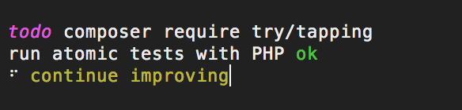

# tapping
> Atomic testing



[](https://travis-ci.org/try-php/tapping)

## Install

```bash
$ composer require try/tapping
```

## Usage

```php
<?php
require_once '/path/to/autoload.php';

use function Tapping\test;

test('some description of the test', function ($t) {
	// throw an Exception or exit(1) to fail a test
});
```

## API

### Functions

#### `test($description, $test)`

Function to run an atomic test and output it's status.

##### Arguments

| Argument | Type | Description |
|---|---|---|
| $description | `string` | The description what the test case is supposed to do. Will be output on test run with an indication of success or failure. |
| $test | `callable` | The test case encapsulated in an callable. The test case will be forked as a child process, so anything in the callable is encapsulated from the parent process. Needs to `exit(1)` or a thrown Exception to indicate test as failed (throwing an exception will render an error block). `exit(0)` or just nothing will mark the test as passed. |

##### CLI Flags

Since the runner of the tests is pure php, it is necessary for the usage in CI pipelines or other build systems that the main test process exists with an error code. Tapping has a build in feature for this.

By providing script flags on script call, e.g.

```bash
$ php test.php --build
```

The test run will exit the whole process with `-1`, as soon as the first test fails.

Flag aliases which trigger such behaviour are `--build` and `-b`.

In addition to the build flag, it is also possible to provide an `--quite` (short `-q`) flag to suppress fail information (File, Line and error that occured).

#### `todo($description)`

Function to show a notation for a test case, not yet written. As reminder or note or whatever.

##### Arguments

| Argument | Type | Description |
|---|---|---|
| $description | `string` | The description of the test to be written. |

### `$t`

The `$t` argument, is a container for prediction and likewise functions.

#### Predictions

* [predict-is](https://github.com/try-php/predict-is)
* [predict-output](https://github.com/try-php/predict-output)
* [predict-exception](https://github.com/try-php/predict-exception)

## License

GPL-2.0 © Willi Eßer, Felix Buchheim